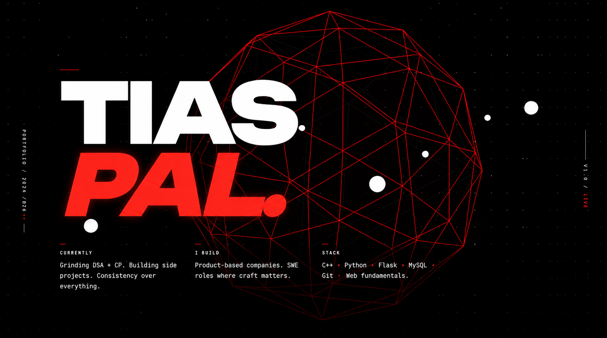
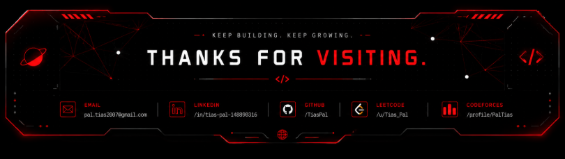

<!-- ========================================================= -->
<!--                        HERO SECTION                        -->
<!-- ========================================================= -->

# ABOUT

I enjoy solving algorithmic problems and building products from scratch.

My goal isn't just to learn frameworks—it's to become a strong software engineer with solid computer science fundamentals.

Currently focused on

- Data Structures & Algorithms
- Competitive Programming
- Full Stack Development
- Backend Engineering
- Open Source
- AI & Machine Learning

> **Consistency over everything.**

---

# TECH STACK

---

## 💻 Coding Profiles

 

# FEATURED PROJECTS

---

## 🚀 TrendNest

> Full Stack E-Commerce Platform

An end-to-end e-commerce platform built from scratch with a focus on backend engineering and clean UI.

### Features

- Secure User Authentication
- Shopping Cart
- Order Management
- Admin Dashboard
- MySQL Database
- Flask Backend
- Responsive Design

### Tech Used

---

## 🌍 Open Source

Contributing to open source to improve engineering skills through real-world collaboration.

Current contributions include

- TheAlgorithms/C++
- Documentation Improvements
- Refactoring
- Data Structure Implementations

---

# GITHUB ANALYTICS

 

---

## 📈 Contribution Activity

---

 

